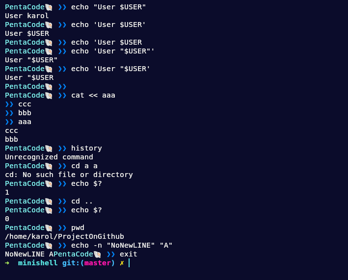

# Minishell

The objective of this project is for you to create a simple shell. Minishell is a project aimed at building a Unix-like shell with a variety of functionalities. From handling basic commands to managing signals,environment variables, pipes and interpreting commands from user, the shell is expected to emulate core features of a Unix shell environment while adhering to specific guidelines and restrictions.

## Tehnologies

## Requirements

- Display a prompt when waiting for a new command.
- Have a working history.
- Search and launch the right executable.
- Handle ’ (single quote) which should prevent the shell from interpreting the metacharacters in the quoted sequence.
- Handle " (double quote) which should prevent the shell from interpreting the metacharacters in the quoted sequence except for $ (dollar sign).
- Implement redirections.
- Implement pipes (| character). The output of each command in the pipeline is
connected to the input of the next command via a pipe.
- Handle environment variables ($ followed by a sequence of characters) which
should expand to their values
-  Handle $? which should expand to the exit status of the most recently executed
foreground pipeline.
- Handle ctrl-C, ctrl-D and ctrl-\ which should behave like in bash.
- Shll must implement the following builtins:
	1. echo with option -n
	2. cd with only a relative or absolute path
	3. pwd with no options
	4. export with no options
	5. unset with no options
	6. env with no options or arguments
	7. exit with no options

## Screenshots

